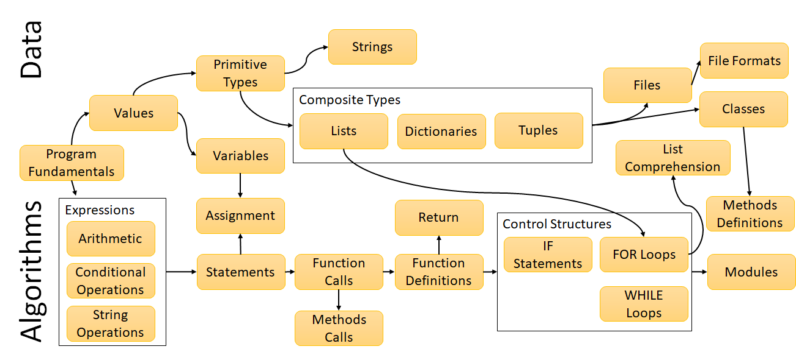

Introduction to Python

Teaching Field Guide

# Table of Contents

[[TOC]]

# Overview

This chapter begins with an overview of the courses' objectives and audience. Then it reviews the course topics and the associated schedule to give a big picture view. The structure of the course and its learning environment is described, describing the course at a daily and weekly level. The role of the staff (particularly for grading) is described, followed by the available technology (including trade-offs). Finally, the chapter concludes with a discussion of design decisions that were made.

## 1 - Introduction

Python is one of the most popular programming languages in the world, thanks to its power and ease of use. These features make it a great language to teach novice programmers, making it simple to pick up while still empowering students to solve real-world problems.

This course is designed with a broad population of learners in mind, aiming to get them programming and building software. Ideally, they will become more than just programmers - they will learn some enduring software development skills that they can transfer to other languages. However, this course is not expected to make them expert developers, but instead to make them competent at reading and writing basic Python and solving relatively small, well-defined problems.

## 2 - Target Audience

The students in this course will be undergraduate non-computing majors, predominately engineers. The course is designed to scale to a large audience, up to several hundred at a time. It should also work for smaller class sizes, too.

**Year: **The course is not designed with any specific group in mind, and should be suitable for freshmen, sophomore, juniors, and seniors.

**Majors: **The material is heavily skewed towards STEM (particularly engineering) students. Less than 5% of the students from the Fall 2017 semester were in the arts or humanities. Assignments are geared towards STEM majors rather than Arts and Humanities, but is not meant to be discriminatory to those populations.

<table>
  <tr>
    <td>Major</td>
    <td>Students</td>
  </tr>
  <tr>
    <td>General Engineering</td>
    <td>21%</td>
  </tr>
  <tr>
    <td>Ind. & Sys. Engineering</td>
    <td>17%</td>
  </tr>
  <tr>
    <td>Mech. Engineering</td>
    <td>17%</td>
  </tr>
  <tr>
    <td>Civil Engineering</td>
    <td>8%</td>
  </tr>
  <tr>
    <td>Physics</td>
    <td>4%</td>
  </tr>
  <tr>
    <td>University Studies</td>
    <td>4%</td>
  </tr>
  <tr>
    <td>Other</td>
    <td>29%</td>
  </tr>
</table>

**Genders: **The class is designed to not cater to one gender, and seeks to support diversity wherever possible. The gender ratio is historically about 2:1 men vs. women, which is above average for many computing classes. 

**Course Interest: **Students were surveyed on why they are taking the course. They were allowed to choose more than one option. Although many students are taking the class for a requirement, they have other interests in the material.

<table>
  <tr>
    <td>Course Interest</td>
    <td>Students</td>
  </tr>
  <tr>
    <td>To fill a requirement</td>
    <td>80%</td>
  </tr>
  <tr>
    <td>To learn how to program</td>
    <td>81%</td>
  </tr>
  <tr>
    <td>To improve my resume/get a job</td>
    <td>57%</td>
  </tr>
  <tr>
    <td>It seems easy</td>
    <td>15%</td>
  </tr>
  <tr>
    <td>To take a class with a friend</td>
    <td>11%</td>
  </tr>
  <tr>
    <td>It seems fun</td>
    <td>43%</td>
  </tr>
</table>

**Prior Computing Experience: **Students were surveyed based on their prior computing experience. Many students actually had some prior experience. Some students will have previously taken one of the AP Computer Science courses in high school (probably Java), and introductory programming courses offered by Virginia Tech (probably MATLAB). Although for some students this prior experience will be beneficial, it can sometimes lead to instances of students over-estimating their ability, negatively affecting the efficacy of nearby peers, and, in some cases, incorrect prior knowledge. The prior knowledge gap can be a huge problem in introductory computing courses, making it difficult to target the courses' difficulty level.

<table>
  <tr>
    <td>Prior Computing Experience</td>
    <td>Students</td>
  </tr>
  <tr>
    <td>Another programming course at Virginia Tech</td>
    <td>57%</td>
  </tr>
  <tr>
    <td>Another programming course at a community college</td>
    <td>4%</td>
  </tr>
  <tr>
    <td>Another programming course in high school</td>
    <td>39%</td>
  </tr>
  <tr>
    <td>An online programming course (e.g., CodeCademy, Coursera)</td>
    <td>20%</td>
  </tr>
  <tr>
    <td>No Answer</td>
    <td>17%</td>
  </tr>
</table>

**Comfort Level: **Students were surveyed based on their comfort level. To summarize, 89% of the students reported some level of comfort with computers in general (at least 75% at the moderately comfortable level or higher). However, only 44% felt some level of comfort with programming in general (and in fact, 40% felt some level of uncomfortableness).

**Self-efficacy: **As opposed to the CS-1014 "Introduction to Computational Thinking" course, the students in 1064 are expected to have more technical proficiency, and will be expected to learn more material at a deeper level. However, they may have less technical proficiency than students in CS-1114 "Introduction to Software Engineering" (the CS majors course) and will learn less material. Interviews with the previous instructor of the course give descriptions of the students that match experiences with students in other introductory courses - low self-efficacy, lack of prior experience, and difficulty with threshold concepts (e.g., loops, data structures) are common.

## 3 - Course Topics

By the end of the course, students should be able to:

* Create simple programs that solve problems using Python.

* Interpret and debug a Python program using debugging techniques.

* Describe, identify, and use core language elements of the Python programming language.

* Represent data using simple and complex types to perform basic data processing.

* Trace and code nonlinear control flow in a program using loops and conditionals.

* Organize code using functional and object-oriented programming strategies.

* Determine when a problem is solvable using computational techniques.

* Summarize, criticize, and participate in computing culture and history

There are two paths of topics in this course: data and algorithms. These paths criss-cross over the course of the semester, but their general progression is shown in the figure below:

On the *data *side, students build up progressively more complex ways to represent values: first as primitive values, then using various composite types (homogenous lists, heterogenous dictionaries), and finally externalizing data into files. Through it all, they need to understand that Python is oriented around data, rather than variables - values have types, and variables have values, but variables do not have fixed types.

On the *algorithms *side, students learn progressively more complicated forms of control flow. First, they get a basic model of sequential execution. Then they see how functions disrupt that flow (and the impact this has on the flow data within the program). Next, they learn branching (IF statements) and loops (FOR loops and WHILE loops). WHILE loops are de-emphasized compared to FOR loops, because they are a less safe form of iteration (and are generally de-emphasized in the language). If you are used to other programming languages, you should become prepared to stop using WHILE loops in favor of the vastly superior FOR loops.

Students learn these topics, but apply them at various levels. On the one hand, they will need to know terminology and use it to communicate ideas. They also need to have a conceptual understanding of the way features in Python work - these are "big ideas" like scope rules, how data flows in a program, and variable naming rules. Most importantly, however, is knowing how to read and write actual code. Writing programs that solve specific and ill-structured tasks, at varying levels of size, is critical to programming.

The last topic shown in the syllabus is to summarize and participate in computing culture and history. Although not necessarily covered at the same level as other course concepts, it is important for students to learn that computing does not occur in a vacuum. Decisions were made by humans about the design and features of the Python language, and software continues to grow and change based on the motivations of the community. Students need to stop treating computing as an external force to be studied, and instead see it as a community to be joined and affected.

## 4 - Course Schedule

The course is organized into weekly modules. Each module has multiple lessons, each of which has a number of assignments associated with them.

1. **Getting Started**: A gentle orientation to the basic ideas of a program, plus the format of the course, help-seeking behavior, and how to be an effective learner.

2. **Basics and Primitives**: Basic ideas of types, values, arithmetic and logical operators, sequential execution, variables, and assignment statements.

3. **Strings and Calling Functions**: How built-in functions and methods can be used, and the ideas of using and manipulating string data.

4. **Making Functions**: The basics of defining a function, and how this affects control flow.

5. **Using Functions**: More ideas of how to pass around data and information with functions.

6. **Ifs and Lists**: Using if statements and operations on lists.

7. **For Loops**: Processing lists of data using FOR loops, and applying common iteration patterns (summing, mapping, filtering).

8. **More Looping**: Important differences between strings and lists, basic idea of WHILE loops (and why we don't use them much).

9. **Dictionaries**: Using dictionaries and the differences between dictionaries and lists

10. **Data Structures**: creating complex data representations by nesting dictionaries and lists, also a bit about tuples and multiple assignment.

11. **Files**: Accessing data in files and online, both as flat text files and in JSON format.

12. **Data Science**: Making plots, using Jupyter notebooks, and conducting data science investigations.

13. **Project and Review**: Time devoted in class to completing the final project and trying the Review material.

14. **Project and Review**: Time devoted in class to completing the final project and trying the Review material.

15. **Conclusion**: Final exam, final surveys, and final words.

### 4.1 - Lesson Format

A typical lesson in this course is composed of 2-3 parts of web-based material:

* Video Presentation: A recorded lecture that covers all the material that students will be assessed on. These videos are meant to be short (around 2-4 minutes in length) and quickly convey the important material. These videos have transcripts, closed captioning, and the PowerPoints that they were generated from all available. Some students may also be familiar enough with the content to not need the videos; students who want to attempt the problems without reference to the videos or transcripts should not be penalized. However, they should be quickly referred back to the videos if they have not already taken advantage of them.

* Canvas Quiz: A combination of multiple choice, true/false, matching, and fill-in-the-blank questions; these quizzes are automatically graded. Students can use as many attempts as they need. The quizzes are typically 5 or so questions. These questions are meant to test students' understanding of the material presented. Each question should have an obvious connection to a learning objective, but may be testing misconceptions related to that objective. 

* Programming Activity: Typically, this is an activity mediated through BlockPy. However, it sometimes has a different form (e.g,. Install some software, use Jupyter Notebooks). These are usually autograded.

Optional readings are also available for most of the lessons, although it should be noted that students don't seem to take advantage of these. Nobody reads textbooks. In fact, much of the material does not have readings annotated - students either didn't notice or didn't seem to care.

Each module covers multiple days of lecture, depending on the course schedule. Options for this lecture time is described in more detail later on.

### 4.2 - Activity Groups

There are six types of graded activities in this course:

* Canvas Quizzes (25%): The aforementioned quizzes administered after each video lesson.

* Programming Problems (25%) : The aforementioned programming assignments administered after most video lessons.

* In-class Activities (10%): These activities are left to the discretion of the instructor. In general, I have used iClickers to ask students follow-up questions or to engage them with lecture. See the Micro-class activities later on.

* Ethics Activities (5%): These short-form writing activities are meant to gauge students understanding of ethics, and is largely meant to fill a university requirement. These are described later on.

* Projects (20%): A series of mini-projects of escalating size and points possible, culminating in a final project that has two weeks of class time devoted to it.

* Exam (15%): The two-part final exam, described later.

A large portion of the course grade (50%) is dedicated to problems that follow a Mastery-learning model: students can repeatedly attempt the problems until they achieve success. The In-class activities are also meant to reward participation. On the other hand, the Ethics Activities and Exam are more performance-oriented; the latter because it is a summative assessment, and the former because of the high human costs involved in grading. The projects give students ample opportunity to test and develop their solutions, but are still somewhat summative by their nature.

### 4.3 - Deadlines

A number of schemes are possible for organizing assignments. A flexible schedule was used in the most recent semester. All assignments for a module open up the friday before the week of that module's classes. Those assignments will lock two weeks later. Assignments are due one week after the module unlocks, but there are no late penalties (the due dates are meant to be guides). Grades for non-automatic assignments will be returned two weeks after the lock date.

This flexible schedule has been popular in the past. However, students who abuse it to wait till the last minute tend to suffer. There is flexibility here for an instructor to adjust due dates as they see fit and try out other schedules to suit their tastes.

## 5 - Learning Environment

This course follows a blended model, which means that there is both a physical aspect to the class and a digital environment. This section describes the requirements for these environments.

**Physical Environment: **The classroom has few specific requirements:

* The instructor should have some place to project slides.

* TAs and instructors should be able to physically approach and interact with individual students.

* Ideally, each student will have access to power for their laptop.

* If possible, students should have enough proximity to turn and talk to each other during the peer instruction activities.

**Digital Environment**: A modern LMS should be used to:

* Distribute video lessons

* Administer and auto-grade quizzes

* Integrate with LTI tools like BlockPy and Web-CAT

* Provide a platform for collecting and grading the larger-scale projects

## 6 - In-class Time

The in-class time for this course is not meant to be spent only lecturing. Instead, it should be a mixture of lecture, peer instruction questions, and time for students to work on problems with access to course staff.

Of course, pure didactic instruction is a useful tool for conveying information and reinforcing big ideas. Slides are available for the instructor that include notes, clicker questions, and ideas for worked examples. Some instructors may feel more or less comfortable with having a lot of lecture - however, the lecture is meant to be light.

In previous semesters, much of class time (half days on Monday/Wednesdays, all day on Friday) have been in-class lab time. The TAs and instructor roam the room and answer student questions. This has proven helpful in engaging students who would not normally come to office hours, despite needing help. This could also be an opportunity for paired programming type activities.

## 7 - Staff Roles

In our typical section, we have a team of Teaching Assistants. These assistants are critical for managing the scale of the class, and help in a number of ways. Although TAs can be both graduates and undergraduates, we have found great success using undergraduate TAs.

### 7.1 - In-class Help

The most important role for the course staff is to attend lecture and assist students working on classwork problems. Not all students come to office hours when they need help - students almost always come to lecture.

TA training can be essential for helping teaching assistants. It is important to help students arrive at answers themselves, rather than simply giving out solutions. Refer to the TA training material for suggestions on how to prepare TAs to be effective in supporting learners.

### 7.2 - Grading

A second important role for the course staff is to grade student work that cannot be auto-graded. This includes the following assignments:

* The 6 Projects

* The 4 Ethics Assignments

* The IDE Installation Activity

TAs should be given feedback on their grading, and activities should be planned to help them align their grading with each other. Rubrics are helpful in guiding the TAs' grading, and are available for most activities.

### 7.3 - Office Hours

Teaching assistants are required to host office hours. We usually schedule 4-5 hours per TA. Coordinate office hours so that most hours are covered, but be open to moving them later in the semester after "hot" hours are determined. You can use a tool like: https://www.when2meet.com/

### 7.4 - Planning and Discussion

The course staff meets once a week to discuss what has gone wrong/well, and what is coming. During this time, we also provide training on how to be an effective TA.

Organizing this once-a-week meeting is very difficult. You can use a tool like: https://www.when2meet.com/, but you must also keep in mind that you'll need a room to meet in. Some TA groups will arrange multiple meetings in order to ensure that everyone can make it.

### 7.5 - Answering Piazza

A course Piazza is available to give students help outside of the regular class time. Students are not allowed to publicly post code solutions - they must do so privately to instructors (this can be difficult to convey to students, and problematic to enforce). When posting code, students should be required to do so correctly (i.e. proper formating, as text instead of as an image) or they will not be helped. In general, course staff should follow the same guidelines they use in helping students during office hour.

### 7.6 - Material Piloting

TAs should be given time each week to try out the material and be prepared to work with students. This is particularly important for new assignments, before they are given to students.

## 8 - Grading

Most of the course is auto-graded, however some assignments are meant to be graded by a human. There are three types of such assignments:

* **Quick verification**: These types of assignments require a mechanical kind of checking - they could almost be done by a computer, but specialized software would be required. Both the IDE Installation and Turtle Art Project fall under this category. The rubrics for these activities are sometimes a set of binary categories: they either completed an aspect or not (e.g., submitted a screenshot of their artwork or did not).

* **Prose evaluation**: Writing activities, such as the Ethics assignments, require a human to grade. These have a provided rubric that is described below.

* **Code evaluation**: Coding activities with less structure, such as the projects, require a human to handle the grading. Rubrics for each of the projects are explained in their requisite section.

### 8.1 - Ethics Rubric

The ethics rubric has 4 levels across 5 components. The levels are assigned points carefully to ensure certain grade outcomes:

<table>
  <tr>
    <td>Level</td>
    <td>Points</td>
    <td>Grade</td>
  </tr>
  <tr>
    <td>Full Marks</td>
    <td>1</td>
    <td>A</td>
  </tr>
  <tr>
    <td>Adequate</td>
    <td>.85</td>
    <td>B</td>
  </tr>
  <tr>
    <td>Inadequate</td>
    <td>.7</td>
    <td>C</td>
  </tr>
  <tr>
    <td>Missing</td>
    <td>0</td>
    <td>F</td>
  </tr>
</table>

The components are divided as such:

<table>
  <tr>
    <td>Component</td>
    <td>Description</td>
  </tr>
  <tr>
    <td>Summarize the Situation</td>
    <td>Summarization accurately captures the most important point or points about the situation to clearly lay out the impacts of the ethical issues on society</td>
  </tr>
  <tr>
    <td>Take a Clear Stance</td>
    <td>The stance is clearly identified. Depending on the type of ethical situation, this could involve either disagreement or agreement with a decision, or a recommendation for a particular outcome or actions.</td>
  </tr>
  <tr>
    <td>Write a Coherent Argument</td>
    <td>The argument should be logically and clearly laid out, without unwarranted conclusions.</td>
  </tr>
  <tr>
    <td>Reference an Ethical Theory</td>
    <td>An explicit, named reference to an ethical theory (e.g., Justice, Utilitarianism) or a guideline from a relevant, well-established computing organization (i.e. ACM or IEEE) is given as context for the argument and explained concisely, clearly, and correctly.</td>
  </tr>
  <tr>
    <td>Use Proper Grammar, Spelling, and Punctuation</td>
    <td>No grammar, spelling, or punctuation mistakes are made that impact the readability of the post.</td>
  </tr>
</table>

Graders can refer to the Ethics Guidelines in the Canvas Pages for more information about how to interpret the components at different levels.

## 9 - Tools

This section details the software tools leveraged in this course:

### 9.1 - BlockPy

BlockPy ([https://think.cs.vt.edu/blockpy/](https://think.cs.vt.edu/blockpy/)) is a web-based, dual block/text coding environment for Python that has a sophisticated autograder. This autograder can be setup to assess students' programs in a number of ways beyond just unit testing: their code can be checked for the presence or absence of structural elements, their code can be run against different inputs, and a complex flow analyzer and type inferencer can detect bad code patterns (e.g., initializing and then never using a variable).

BlockPy features a block interface, but most students do not need or want this feature. Therefore, they will typically work in the text interface. The block and text interfaces are kept in sync with each other, if students choose to use those interfaces. They are also able to write their code in an external editor and upload their code instead.

As a research project, BlockPy is an ongoing effort that has many advantages over a traditional editor, but also some key disadvantages. Not every Python feature is available (e.g., at the time of writing, you cannot write to files or import certain libraries like Pandas). Developing new problems requires some expertise with the Instructor API (although we are in the process of simplifying this). Some reasonable alternatives to BlockPy could be:

* CloudCoder (although this does not seem to have LTI support)

* CodeWorkout (although their python support is in progress)

* CodingBat (although their problem collection is limited)

### 9.2 - Anaconda

Installing Python is ultimately necessary in the course, but will be a bit of a headache when it comes to managing packages and versions. Therefore, we use the Anaconda distribution ([https://www.anaconda.com/download/](https://www.anaconda.com/download/)) to simplify installation. This not only install Python, but popular packages (MatPlotLib, Requests) and tools (Jupyter Notebooks and Spyder). Further, the built-in Conda package manager offers a more extended set of pre-built packages if further packages are necessary.

### 9.3 - Spyder

	Students need experience with a real programming environment. BlockPy is great for small structured activities, but not sufficient for larger projects. Further, working in a real editor is important for students to develop real-world expertise. Therefore, we use Spyder, because it comes packaged with Anaconda.

	Spyder is a professional, Data Science oriented programming environment. Besides an integrated editor and console, it also has an integrated debugger and several other useful features. It can be somewhat cumbersome, but seems to be stable enough. However, as of 2018 it is being deprecated and will not be supported. Some reasonable alternatives to Spyder could be:

* Pycharm (a professional programming environment for Python on par with Eclipse or IntelliJ IDEA)

* Thonny (described below)

* Jupyter Notebooks (described below, but not necessarily suitable for all projects)

* Wing (a fairly modern python editor)

* Idle (do not use Idle, it is a garbage editor)

### 8.4 - Jupyter Notebooks

	Jupyter Notebooks is a professional tool for developing reports, popular in many data science and research communities. Jupyter allows you to embed code, the results of the code, and prose into one document. Afterwards, students can download an HTML representation of their document. BlockPy has support for grading Jupyter Notebooks. 

JupyterLabs is a modern evolution of Jupyter Notebooks that features a more full featured programming environment. It could be investigated as a potential programming environment, although its sensibilities are more for document writing than system development.

### 9.6 - NotePad++/Sublime

	In the first semester, students were not required to install any programmer-friendly text editors. Therefore, their operating system did not have any applications registered to open .PY files (or other special data files). Students would use various pieces of software (e.g., Word) to open documents, and would also get alarmed when they could not "see" their Python files. Therefore, we now have them install a modern text editor that registers with their files. We do not mandate a specific editor, but have a whitelist of acceptables ones. Most students are recommended to use NotePad++ on Windows and Sublime on Mac.

### 9.7 - PythonTutor

The online PythonTutor website (http://pythontutor.com/visualize.html) is a powerful way to visualize code. Not only will it perform step-by-step statement-level execution, but it will also visualize memory layout. Code can be shared, and instructors can even instantiate an interactive, collaborative session. I have used PythonTutor during class demos and particularly in one-on-one tutoring sessions.

### 9.8 - Thonny

This is a beginner-friendly Python IDE (http://thonny.org/), and I would describe it as on-par with Spyder in terms of features. A major advantage it has over the PythonTutor is that it can step through expressions (as opposed to statements); a disadvantage is that it doesn't do the cool memory layout that PythonTutor does. During in-class demos and office hours, I have used both Thonny and the PythonTutor to highlight certain ideas. Thonny is in active development and seems to have some strong potential - I would recommend it as a potential replacement for Spyder.

## 10 - Assessments

To assess students' mastery of the material, there are three activities meant to be summative assessments of their understanding. These are scheduled for the end of the semester, and considerable time and attention are spent preparing students to succeed at them.

A number of TAs suggested that students might perform better in the course if midterms were used. These could incentivize students to pay more attention to the material and actually learn it.

### 10.1 - Final Project

The final project is meant as an escalation of the other programming projects. It should be specifically designed to not be able to be completed in a single sitting. Ideally, it will require students to apply a majority of the skills they have developed in the course, while still allowing for some freedom of expression. The final project is discussed more in the final chapter.

### 10.2 - Concept Exam

The final exam has two parts. The first part is a subset of the questions asked in the Canvas Quizzes, administered through the same Canvas feature. The quiz covers the entirety of the course content by administering a different random subset to each student, in such a way as to make sure that almost all questions are asked at least once to at least 50-60 students. Further, each student is receiving a different copy of the exam, which makes it more robust against cheating. The final exam is discussed more in the final chapter.

### 10.3 - Programming Exam

The final exam has two parts. The second part is a subset of the programming questions asked in BlockPy, administered through the same Canvas interface. The quiz covers only a subset of the course, with questions chosen to balance difficulty and importance. There are many opportunities for partial credit on this exam. The final exam is discussed more in the final chapter.

## 11 - Design Decisions

This section will document design decisions that were made in developing the course.

**Why don't you teach Objects/Classes/OO more?**

Two lessons were dedicated to writing classes, but this didn't seem like enough. It's likely that an entire module needs to be dedicated to this topic. Instead, we approach objects from more of a "use" side than a "create" side. 

**Why don't you teach Functional Programming more?**

We tried having a single day dedicated to them, and there wasn't enough time. You could probably replace one of the project weeks with a week on FP.

**Why don't you teach Sets?**

We had a lesson on it, but it wasn't important enough material to keep it around. You could probably put it back in without any problems.

**Why don't you teach Recursion?**

Recursion is de-emphasized in Python compared to other forms of iteration. In particular, the language does not perform optimizations like tail recursion and has a relatively small call stack limit. Although some research indicates recursion might be easier to learn than other forms of iteration, there is also some evidence that teaching recursion first makes it harder to learn iteration later.

**Why do you De-emphasize While loops?**

While loops are extremely uncommon compared to For loops in Python. They are also rife with opportunities for students to get caught in infinite loops. Finally, the Python wiki itself suggests they are uncommon: https://wiki.python.org/moin/WhileLoop

# Course Setup

This section breaks down precisely what must be done each semester to get a new instance running.

## 1 - Prepare Canvas

1.1 - [ ] Crosslist any additional sections

1.2 - [ ] Import most recent version of canvas course

1.3 - [ ] Fix LTI configurations (update visibility to be public, fix shared secret and key)

	1.3.1 - [ ] BlockPy

	1.3.2 - [ ] Web-CAT

1.4 - [ ] Setup Piazza (visit the Piazza tab and step through the options)

1.5 - [ ] Update Syllabus with most recent information

1.6 - [ ] Establish Open/Due/Lock Dates

## 2 - Organize Course Staff

2.1 - [ ] Send introductory email

2.2 - [ ] Arrange weekly staff meeting

2.3 - [ ] Arrange office hours

2.4 - [ ] Enroll TAs in Canvas course

2.5 - [ ] Update course staff page

2.6 - [ ] Enroll TAs in Staff Mailing List (e.g., through Google Groups)

## 3 - Final Touches

3.1 - [ ] Publish Canvas course

# Weekly Plan

This section breaks the course down into its weekly modules, and then breaks down the lessons in each of those modules. To prepare yourself each week, you should pay careful attention to the weekly modules, and then refer to the individual lessons as needed.

## Module 0 - Getting Started

A gentle orientation to the basic ideas of a program, plus the format of the course, help-seeking behavior, and how to be an effective learner.

Before the week begins:

* Read over this document

* Check out your classroom to make sure it fits the requirements

Topics:

* Basics of programs, programming, programming languages, and computing in general

* Basic idea of execution

* How to be a good learner (working early/often, misconceptions about learning CS like learning styles)

* Help-seeking behavior (i.e. how to ask for help)

* Installation of Anaconda and a Text Editor locally

* Trying out BlockPy

Materials: 

* week0_day1_Introduction.pptx

* week0_day2_Python.pptx

Due this week:

* N/A

Graded this week:

* N/A

Things to do during class:

* Lecture

Things to do after class: N/A

### Week 0 - Staff Meeting

Agenda:

* Everyone introduce (name, section, prof/GTA/UTA, year, major)

    * "I'm Dr. Bart, I'm the professor of the MWF section, this is my second year teaching, and I'm a professor in Computer Science"

* Resolve practical questions

* Assign TA homework

* Review course format (refer to the first chapter of this document)

    * How modules work, how lessons work

* Review course topics (refer to the first chapter of this document)

* Explain TA policies (refer to policy document on Google Drive)

* First activity for grading "Python Installation"

Things to Resolve:

* Who's attending which class

Training Materials:

* For now, think about what makes a good or bad TA, write some things down.

* Next week, we'll start talking about Ethics in TAing.

* Read over: http://www.cs.virginia.edu/luther/2910/S2017/fromTAs.html


Grading Reminders:

* N/A

### #1) Lesson: Introduction

Summary: In this lesson, you'll learn the basics of programs and programming. You'll get a chance to write some short programs to escape a maze. In class, we'll learn more about the course and your instructors.

Learning Objectives:

* Describe major course concepts and policies

* Use the Canvas site to access course materials

* Define "programming"

* Explain why programming is useful

* Identify limitations of programming

* Enumerate the core components of programs

* Write simple programs

Activities:

* Quiz

* Maze game

Misconceptions:

* Maze 10 is tricky. Can be useful to remind students that their answer may not guide their avatar to the goal directly, they may take some wrong turns along the way. Also helps to explain the Left-hand-on-wall rule (which doesn't require a particular maze):

    * if there is a path to the left, go left;

    * otherwise, if there is a path ahead, move forward;

    * otherwise turn right.

Note that the wording here is significant (going left means turn AND move).

* Some students fail to see how they need to place blocks WITHIN the [repeat] block in order to have commands execute repeatedly. Explaining the code aloud seems to help.

* Some students "succeed" in a level, but it doesn't register as finished. The problem is that they ran into the wall, and it won't count that as success (even though they're at the marker). Typically, their code will be a convoluted mess to accomplish this, so I tell them that they should find a simpler solution, and give them a hint: there's only two if or if/else blocks needed. But in some cases, it's just because they ran into a wall - the developers of the maze felt that you had to LAND on the solution, not just touch it and move on.

* Some students might fail to notice the new blocks when they are available (e.g., the if/else blocks in addition to the if/then).

### #2) Lesson: Languages

Summary: In today's lesson, you'll learn some fundamental terminology about programs. You will also be installing Python.

Learning Objectives:

* Define the term "programming language"

* Describe the difference between syntax, grammar, and semantics

* Explain the meaning of the terms "run" and "execute".

* Install Python on your laptop.

* Use BlockPy to run a program.

Activities:

* Quiz

* Python Installation

Misconceptions:

* Students do not follow the instructions very closely. They'll think they know what to do for submitting, and leave things out. Refer them to the instructions wherever possible.

* There are always installation issues with Anaconda - either because of technical failures or because of student mistakes. Start writing down common problems and solutions and sharing them among the course staff.

* Some students think "Day 2 == Lesson 2" and that's it. They don't realize they should keep going with the material.

### #3) Lesson: Execution

Summary: In today's lesson, you'll learn how we use programs by running them. You will also be trying BlockPy.

Learning Objectives:

* Explain the meaning of the terms "run" and "execute".

* Use BlockPy to run a program.

Activities:

* Quiz

* Try BlockPy (just one quick question)

Misconceptions: N/A

### #4) Lesson: How to Learn

Summary: In today's class, you'll learn about how to be a good learner in this course.

Learning Objectives:

* List common misconceptions about learning.

* List best strategies for learning to program.

* Assess prior knowledge of programming

Activities:

* Quiz

Misconceptions: N/A

### #5) Lesson: Getting Help

Summary: In this lesson, you will learn how to correctly ask for help.

Learning Objectives:

* Seek help by communicating desired functionality, approach, perceived problems, current code, and specific errors.

Activities:

* Quiz

Misconceptions: N/A

## Module 1 - Basics and Primitives

Basic ideas of types, values, arithmetic and logical operators, sequential execution, variables, and assignment statements.

Before the week begins:

* Print out consent forms

* Finalize office hours

Topics:

* Basic values in Python (integers, floats, booleans, strings, and None)

* Idea of types

* Basic math operators (+, -, /, *, ** ,%)

* Basic comparison operators (<=, >=, <, >, ==, !=)

* Basic logic operators (and, or, not)

* Creating/using variables

* Statements vs. expressions

* Tracing

Materials: 

* week1_day1_Values.pptx

* week1_day2_Variables.pptx

Due this week:

* Module 0 quizzes and programming problems

* Survey 0

Graded this week:

* N/A

Things to do during class:

* Lecture

Student difficulty:

* Low - few questions asked in class

Things to do after class: N/A

### Week 1 - Staff Meeting

Agenda:

* TA Training

    * Discussion of "What not to do"

    * Working on a whiteboard, make a list of "what makes a good/bad TA"

* Resolve practical questions

* First activity for grading "Python Installation"

    * Simple binary grading: from the screenshot, do you believe that they have Spyder and a programmer-friendly editor installed?

    * Your grading assignment will be released on Saturday morning

    * You will have until Feb 9 to return all the grades

    * Expectation: should take less than 30 minutes

* Looking forward:

    * Reading error messages (stack traces)

    * More about strings (quoting character, multiline strings)

    * String operations (indexing, subscripting)

    * Calling String methods (calling methods, e.g., title, upper, strip, find)

    * Calling functions (e.g., int, float, round)

    * First project: Turtle Art (make a picture in turtle graphics, be familiar with the API)

Things to Resolve:

* In-class procedures

    * Material starts relatively easy, but does escalate

    * First and foremost, pay attention for student questions

    * Keep talking between TAs to a reasonable minimum

    * Please sit throughout the room

* TA Project 1 submissions are due before the next Staff Meeting

* Feedback reports are due next week

Training Materials:

* Equity of Access

    * Only TA when on the clock

    * Handling raised hands

    * Equity reviews

* Conflict of Interest

* FERPA

* Mandatory Reporting

* "Some parts of TAing you learn by doing; we'll do our best to prepare you, but you won't understand the full implications until you have seen what we're talking about first-hand."

* Next week: Basic Learning Sciences


Grading Reminders:

N/A

### #6) Lesson: Console IO

Summary: In this lesson, you will learn about how to write programs use input and output.

Learning Objectives:

* Use the "input" function to retrieve input from the user

* Use the "print" function to display data to the user

* Identify possible outputs of a program (printing, graphics, robots)

* Identify possible inputs to a program (keyboard, mouse, files, sensors)

* Explain the necessity of "print" vs. debugging tools

Activities:

* Quiz

* Programming problems

Misconceptions: N/A

### #7) Lesson: Values

Summary: Data is stored in computer's memory as values.

Learning objectives:

* Explain the purpose of values

* Identify a literal value

Activities:

* #7) Quiz: Values

Misconceptions: None listed so far

### #8) Lesson: Types

Summary: Every value has a type, which determines what the data can do. The five basic types in Python are Strings, Floats, Integers, Booleans, and None.

Learning objectives:

* List the types

* Write syntactically correct String, Float, Integer, Boolean, and None values

* Identify the type of a literal value

* Compare and contrast types

* Define the types

* Define the idea of a type

Activities:

* #8) Quiz: Types

* #8) Programming: Types

Misconceptions: None listed so far

### #8) Lesson: Types

Summary: Every value has a type, which determines what the data can do. The five basic types in Python are Strings, Floats, Integers, Booleans, and None.

Learning objectives:

* List the types

* Write syntactically correct String, Float, Integer, Boolean, and None values

* Identify the type of a literal value

* Compare and contrast types

* Define the types

* Define the idea of a type

Activities:

* #8) Quiz: Types

* #8) Programming: Types

Misconceptions: *None identified so far*

### #9) Lesson: Arithmetic

Summary: Mathematical operators like +, -, and * can be used to combine mathematical values.

Learning objectives:

* Identify the type of an arithmetic expressions

* Write a mathematical expression that uses +, -, *, **, /

* Describe the limitations of the basic operators with regards to their number of parameters

Activities:

* #9) Quiz: Arithmetic

* #9) Programming: Arithmetic

Misconceptions: *None identified so far*

### #10) Lesson: Conditionals

Summary: Logical operators like >, ==, and "or" can be used to combine any kind of values to ask True/False questions.

Learning objectives:

* Identify the type of a conditional expressions

* Describe the limitations of the basic conditional operators with regards to their number of parameters

* Write equivalent expressions using different equality operators

* Write a complex conditional with logic operators

* Simplify a boolean equivalency check

* Write a logical expression that uses AND, OR, NOT

Activities:

* #10) Quiz: Conditionals

* #10) Programming: Conditionals

Misconceptions:

* Students think that OR and AND are distributive (a == 5 or 6), even though they are not.

### #11) Lesson: Variables

Summary: Variables store values so that they can be used later in the program. Variables are created and updated using assignment statements.

Learning objectives:

* Write a program that creates/reads/updates variables

* Identify valid and invalid names in python

* Identify the type of a variable

* Differentiate between algebraic variables and programming variables

* Write an assignment that involves literal values

* Write an assignment that involves variables

* Write an assignment that involves expressions

* Write an assignment that updates a variable

Activities:

* #11) Quiz: Variables

Misconceptions:

* Students often confuse algebraic equivalence with assignment statements.

### #12) Lesson: Tracing

Summary: Variables store values so that they can be used later in the program. Variables are created and updated using assignment statements.

Learning objectives:

* Trace the value of a variable over the execution of a program

* Identify the lifetime (e.g., creation point) of a variable

Activities:

* #12) Quiz: Tracing

* #12) Programming: Tracing

Misconceptions:

* Students often confuse algebraic equivalence with assignment statements.

### #13) Lesson: Statements and Expressions

Summary: A program is composed of statements, such as an assignment statement. Those statements can be built up out of expressions, which combine values, variables, and operators. The order of these statements and expressions are definite.

Learning objectives:

* Predict the output of a multi-line program

* Order multiple statements correctly

* Describe how programs are executed in a sequence

* Trace the values of multiple variables in a program

* Identify an expression

* Identify the type of an expression

* Write syntactically correct values that incorporate complex expressions

Activities:

* #13) Quiz: Statements and Expressions

* #13) Programming: Statements and Expressions

Misconceptions: *None identified so far*

## Module 2 - Strings and Calling Functions

More about strings, and information about string operations (e.g., indexing). Using built-in functions and methods.

Before the week begins:

Topics:

* How to read error messages (particularly the line number and error type)

* Making strings with escaped characters, triple quoted strings

* Using string operators like index and subscripting (i.e., square brackets)

* Calling functions and methods

* Using string methods

Materials: 

* week2_day1_Strings.pptx

* week2_day2_Calling.pptx

Due this week:

* Module 1 quizzes and programming problems

Graded this week:

* N/A

Things to do during class:

* Lecture

Student difficulty:

* Low - TAs were engaged during class time, but not overwhelmed. Most student questions seemed to be answered quickly.

Things to do after class: N/A

### Week 2 - Staff Meeting

Agenda:

* Resolve practical questions

    * InternalError: When you encounter a black InternalError in Python, you need to notify Dr. Bart as soon as possible.

* Reminder:

    * Grade Python Installation activity

    * First project this week

        * Any problems encountered by the TAs when trying the project?

* Submit TA Feedback Report on Friday

    * Summarizes what has gone well, what has not

    * Your chance to help us redevelop the course.

* Looking forward:

    * Debugging - Problem-solving strategies (wolf-fence, rubber ducks, scientific method)

    * Defining functions - syntax, basic idea and metaphor

    * Unit testing - How we determine if functions are correct

    * Return vs. Print - The difference between them

    * Scope - Variables defined inside a function cannot be used outside of it, and vice versa.

    * Ethics Activity 1: Prompt on Net Neutrality. Make sure you read over the assignment instructions and its guide. TAs are responsible for using the Rubric when grading, and you must never assign points without using the rubric. Make sure you are using the interface to grade, not assigning points randomly.

* TA Training: "How People Learn"

    * Learning Styles: The DEBUNKED theory that teaching students according to their preferred style ("auditory", "visual", "kinestic") will improve their learning. Multiple peer reviewed studies suggest this is not the case.

    * Cognitive Load Theory: A collection of useful, well-studied theories and effects that break down how people absorb information.

        * [Dual-Channel Theory](https://en.wikiversity.org/wiki/Cognitive_Theory_of_Multimedia_Learning) suggests that people learn better when multiple modalities are engaged (so talking as you write on the board, or having a text annotation on an image, is better than not). 

        * Every lesson has an Intrinsic load (necessary to complete the task), an Extraneous load (unrelated to the task), and Germane load (necessary for the learning). For example, a problem that has you tracing a FOR loop to process a list of prices requires:

            * Keeping the list of numbers in your head (intrinsic)

            * Knowing how to process a FOR loop (germane)

            * Ignoring the fact that these are prices (extraneous)

Your job as a TA is to manage student's extraneous load and avoid letting them be distracted. A common source of distraction is stress, which can be contagious, so keep your own stress levels down.

    * [Bloom's Taxonomy](https://cft.vanderbilt.edu/wp-content/uploads/sites/59/Blooms-Taxonomy-650x366.jpg): Knowledge can be categorized at different levels, which build on each other. Knowing where on the taxonomy a student is struggling (e.g., with remembering terminology, or applying a rule, or being creative) can help diagnose their misunderstanding.

    * MUSIC Model of Academic motivation: The drive and energy to complete academic tasks can come from 5 sources:

        * eMpowerment: agency and freedom to explore and direct their learning. As a TA, you have minimal power here, but finding opportunities to empower students is good ("Did you know you can change the color of the turtle's line?").

        * Usefulness: the sense of long-term and short-term benefit of learning the material. Connecting a lesson or the class goals with students' individual goals will help support them.

        * Success: the self-efficacy, or belief by the students that they can complete tasks. Programming is often hard, so helping students manage their struggle is important. Express confidence in their ability (when appropriate) to help students understand they can accomplish things given time and practice.

        * Caring: the belief that classmates, instructors, and TAs want them to succeed. Simply letting students know you're available and want to help them is a good thing.

    * [Gagne's Nine Events](http://s4.thingpic.com/images/j7/uS44Q1YxM1NADqN1c4tP6izj.png): An instructional model for designing a lesson. Making sure you hit all these elements can ensure learning in a more systematic way. In general, make sure that each lesson is a combination of Presentation of content, Participation by the student, and Feedback from the TA.

### #15) Lesson: Strings

Summary: You should now feel comfortable with representing a string in your computer, and then manipulating them.

Learning objectives:

* Define the concept of a string

* Create a string literal

* Create a triple-quoted string

* Incorporate escape characters into a string

Activities:

* #15) Quiz: Strings

* #15) Programming: Strings

Misconceptions:

* Students often think that strings with numbers are actually integers.

* Students sometimes confuse variables and strings.

### #16) Lesson: String Operations

Summary: Strings can be manipulated according to their own rules and operations, distinct from integers and booleans.

Learning objectives:

* Combine string expressions

* Compare two strings

* Subscripting a character from a string

* Subscripting a range of characters from a string

* Using implicit indices to access string elements

* Using negative indices to access string elements

Activities:

* #16) Quiz: String Operations

* #16) Programming: String Operations

Misconceptions: *None identified so far*

### #17) Lesson: Calling Functions

Summary: Functions are a fundamental unit of programs, which we can use to break down tasks. Functions take in arguments and return data, just like programs. Functions are a powerful way for programmers to share code with each other, too. Some functions are known as methods, and are strongly associated with a value.

Learning objectives:

* Define the term Function

* Identify the necessary and optional parts of a Function call

* Explain the purpose of a Function

* Compare and contrast a function with a program

* Call a function with a return value

* Call a method with a return value

* Call a function with an argument

* Call a method with an argument

* Compare and contrast printing vs. returning from a function

Activities:

* #17) Quiz: Calling Functions

* #17) Programming: Calling Functions

Misconceptions:

* They believe that print is a part of a function call

* They believe that print is a statement rather than a function itself

### #18) Lesson: Calling Functions 2

Summary: Python comes with a huge number of built-in functions and methods. Programmers learn how to use these by referring to documentation. In practice, functions are often called in combination with other functions, methods, and operations.

Learning objectives:

* Interpret documentation for a function

* Use a function based on its documentation

* Distinguish between Parameters and Arguments

* Nest a function call inside another function call

* Chain a method onto another method

* Combine functions, methods, and operators into a complex expression

Activities:

* #18) Quiz: Calling Functions 2

* #18) Programming: Calling Functions 2

Misconceptions: *None identified so far*

Project 1: Turtle Art

Summary: Students create a work of art using the built-in Turtle graphics module. Turtle graphics are an easy way to draw images in Python by moving a virtual turtle around the screen (turtle.forward, turtle.right, turtle.left, etc.). 

Learning Objectives:

* Download and modify starting code

* Submit a working .PY file

* Write a longer (>20 lines) program

* Call methods to accomplish a task

* Be creative

* Have fun

Misconceptions:

* After uploading their completed program, students redownload the file and attempt to open it. Their systems are not properly configured to open the file, and instead it runs. This prevents them from seeing the actual code. You will need to explain what code is and how they can open it in Spyder or their code editor.

## Module 3 - Making Functions

Creating simple functions.

Before the week begins:

Topics:

* Stategies for debugging programs

* Basic syntax and idea of creating functions. 

* Reading and responding to unit tests

* The difference between printing and returning

* Interpreting function scope

Materials: 

* week3_day1_Functions.pptx

* week3_day2_MoreFunctions.pptx

Due this week:

* Module 2 quizzes and programming problems

* Project 1

Graded this week:

* Python Installation Activity

Things to do during class:

* Lecture

Student difficulty:

* ???

Things to do after class: N/A

### Week 3 - Staff Meeting

* Reminders:

    * Python Installation activity must be graded this week

    * First project is due this week (Turtle graphics)

        * Grading is binary and simple - they either completed the instructions or did not. Common issues:

            * Did not draw a black border? No points.

            * Uploaded code as a screenshot? No points.

            * Uploaded code in a word doc? No points.

            * Drew a single line and gave up? No points.

    * TA Feedback Report was due on Friday

* Ethics Activity

    * Read the assignment description

    * Read the guide

    * Prompt: Net Neutrality

    * Demonstration of grading assignment through Canvas.

        * ASSIGN POINTS THROUGH THE RUBRIC, NOT AT RANDOM

* Project 2: Magical Banking

    * Context: writing an app to approve or reject loans for a magical bank

    * Need to integrate weird code from a grumpy co-worker, without touching it.

    * Main goal is to learn about program flow and satisfying unit tests

    * Write a function that calls several other functions, and also define those functions

    * Each function is individually very simple, but the combination of all of them will be challenging for some students who have not incorporated these ideas.

    * Difficulty level is higher than last project, hopefully around a 2-4 hour project for most students.

    * Expect many students to ignore the unit tests

    * Added problem: students will be using web-cat for the first time.

    * You'll need to try it out and complete it yourselves

    * Monday Class:

        * Room organized into color groups using construction paper

        * Start with brief lecture highlighting project components

        * Students are encouraged to work together on handout assignment (function tables) and the first two functions (print_introduction and input_name)

        * Also have a reference sheet with info about reading output diffs

        * Your role: mark down who completed the assignment (you'll have a spreadsheet of names), make sure they have completed it correctly -> simpler if they work together and you can grade multiple at the same time.

        * Answer questions, but try to answer groups instead of individuals - steer people towards their peers

        * Each TA will have their own color that they're responsible for (about 20-30 students each). One TA will be a Meta TA walking around helping out as needed

        * Goal: get them started on the project, via fostering community

* Looking forward:

    * Documenting - Writing comments and multi-line comments

    * Function Development - creating more complex functions, particularly by extracting repeated code

    * Data Flow - seeing how values flow through a program

* TA Training: Problem Students I

    * "You are a Teaching assistant, not a Passing assistant".

    * 3.1 Students who want the answer, not learning

        * Ask questions

        * Solve in a different context

        * Make them do something before going on

        * Look at them, not the computer

        * Say "no"

        * Avoid becoming an oracle

        * https://www.cs.virginia.edu/luther/ta-training/students.html#students-who-want-the-answer-not-learning

    * 3.2 Students whose question is answered in the assignment writeup

        * Ask them "Please go to the assignment writeup. Read it aloud to me."

        * https://www.cs.virginia.edu/luther/ta-training/students.html#students-whose-question-is-answered-in-the-assignment-writeup

    * 3.3 Students who insist on doing it the wrong way

        * Neither force nor ignore

        * Give them a choice, "I can provide excellent help with a better approach, or vague help with your current approach."

        * https://www.cs.virginia.edu/luther/ta-training/students.html#students-who-insist-on-doing-it-the-wrong-way

    * 3.5 Students who seem not to have attended class or read the textbook

        * If you have tons of time, you can teach them

        * But otherwise, redirect them to the course resources (book, slides, google)

        * If they refuse, then you can refuse to help them.

        * https://www.cs.virginia.edu/luther/ta-training/students.html#students-who-seem-not-to-have-attended-class-or-read-the-textbook

### #19) Lesson: Debugging

Summary: When you encounter an error, you should attempt to debug them (using print statements, meticulously explaining your code, etc.).

Learning objectives:

* Choose the most suitable debugging method to debug a program

* Compare and contrast different debugging techniques

* Explain how you can use automatic tracing tools to debug a program

* Explain how you can use print debugging to debug a program

* Explain how you can use code tracing to debug a program

* Explain how you can google to debug a program

* Explain how you can use rubber duck debugging

Activities:

* #19) Quiz: Debugging

Misconceptions: *None identified so far* 

### #20) Lesson: Defining Functions

Summary: Function definitions have a body of code and are described by their header. Creating functions is necessary for building up programs of scale.

Learning objectives:

* Determine if a situation could benefit from a function

* Break down a complex task into multiple function calls

* Identify the scope of variables in and outside of a function

* Define a function with a return value

* Describe the difference between parameters and arguments

* Define a function without parameters

* Define a function with parameters

* Extract a variable from a function into a parameter

* Describe the signature of a function

Activities:

* #20) Quiz: Defining Functions

* #20) Programming: Defining Functions

Misconceptions:

* Students believe that any code should be encapsulated in a function, instead of code that needs to be reused or worked on in isolation.

* Students attempt to add "types" to the arguments by surrounding the parameter names with quotes, square brackets, and other literal symbols.

* Students attempt to nest function definitions into other control structures

* Students print instead of using return

### #21) Lesson: Unit Tests

Summary: Unit tests are used to ensure that a function is correct.

Learning objectives:

* Explain how functions are tested for correctness.

* List advantages of using unit tests

* Intepret a failing unit test

* Describe the limitations of unit tests

Activities:

* #21) Quiz: Unit Tests

Misconceptions: *None identified so far* 

### #22) Lesson: Return and Print

Summary: Returning from a function causes a value to be made available at the callsite. Printing from a function makes a value appear on the console.

Learning objectives:

* Differentiate between a return statement and a print function

* Identify the output of a function that does not return anything

* Identify the output of a function that prints instead of returns

* Identify a callsite

Activities:

* #22) Quiz: Return and Print

Misconceptions: *None identified so far* 

### #23) Lesson: Scope

Summary: Variables created inside a function cannot be used outside the function, and variables created outside a function should not be used within.

Learning objectives:

* Determine whether a variable is available within a function.

* Determine whether a variable is available outside a function.

* Determine whether a variable is aliased within a function.

* Define the difference between a global variable and a local variable.

* Explain why global variables are bad.

Activities:

* #23) Quiz: Scope

Misconceptions: *None identified so far* 

**_The following is in-progress_**

## Module 4- Using Functions

Week 4 - Staff Meeting

#24) Lesson: Documenting

#25) Lesson: Function Development

#26) Lesson: Data Flow

Project 2: Fixing the Flow

Module 5 - Ifs and Lists

Week 5 - Staff Meeting

#27) Lesson: If Statements

#28) Lesson: Truthiness

#29) Lesson: Nested Ifs

#30) Lesson: Lists

#31) Lesson: List Operations

Module 6 - For Loops

Week 6 - Staff Meeting

Project 3: Survey Processing

#32) Lesson: For Loops

#33) Lesson: Loop Patterns

#34) Lesson: Mutability

Module 7 - More Looping

Week 7 - Staff Meeting

#35) Lesson: Lists and Strings

#36) Lesson: Lists and Indexes

#37) Lesson: List Comprehensions

#38) Lesson: While Loops

Module 8 - Dictionaries

Week 8 - Staff Meeting

Project 4: Text Adventure

#39) Lesson: Dictionaries

#40) Lesson: Dictionary Patterns

#41) Lesson: Lookup and Find

Module 9 - Data Structures

Week 9 - Staff Meeting

#42) Lesson: Nesting Data

#43) Lesson: Nesting Data 2

#44) Lesson: Tuples

Module 10 - Files

Week 10 - Staff Meeting

#45) Lesson: Filesystems

#46) Lesson: Files

#47) Lesson: File Formats

#48) Lesson: Modules

#49) Lesson: Plotting

Module 11 - Data Science

Week 11 - Staff Meeting

#50) Lesson: Web Data

#51) Lesson: Jupyter Notebooks

#52) Lesson: Data Science

Project 5: Data Science

Module 12+13 - Project and Review

Week 12 - Staff Meeting

Week 13 - Staff Meeting

Project Final: Canvas Analyzer

Information: Final Exam Guidelines

Review: Practice Exam Part 1

Review: Practice Exam Part 2

Review: Practice Exam Part 3

Review: Practice Exam Part 4

Review: Programming

Review: Programming 2

Module 14 - Conclusion

Week 14 - Staff Meeting

Exam: Part 1

Exam: Part 2

Survey: Final

Survey: Anonymous TA/Instructor Feedback

Final Message

