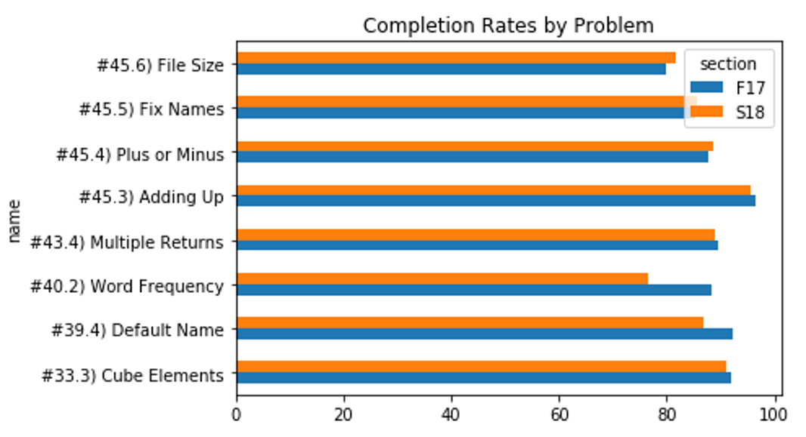
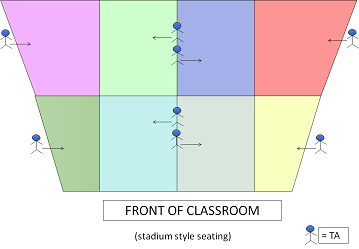
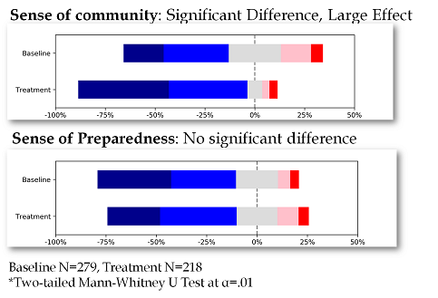

# Action Design Research

In the 2019 SIGCSE paper about the Python Sneks curriculum, two experiments were
briefly described. These experiments followed a model of Action Design Research.

> Educational research is frequently confounded by the rapidly changing target
> space and variability between semesters, frustrating efforts to control
> populations for experimental validity. We share the beliefs suggested by
> [Nelson and Ko [21]](https://faculty.washington.edu/ajko/papers/Nelson2018Theory.pdf), that the quest for unarguably valid experimental results
> is a detriment to progress in perfecting designs within computing
> education. The Sneks curriculum is ultimately a design artifact, and
> so frequently decisions were made that could affect the sanctity of
> our experiments. We allowed modifications in a systematic way
> that would contribute to the research space, while acknowledging
> the dynamic nature of educational settings. Therefore, we approach
> our modifications from a Action Design Research (ADR) perspective.
> When ADR is used in an educational setting, the result is
> similar to Instructional Design: an iterative cycle of identifying
> problems in existing curricula, implementing changes, and observing
> the impact. Therefore, the interventions presented in this section
> should be taken with the caveat that the studies are static-group
> comparison designs, and understood for their limitations.

On this page, I have attempted to describe the experiments with more depth than
we could fit in the original 6 pages. Due to time concerns, they were not
described in depth in the SIGCSE presentation. Although hardly ideal, we felt
that this was a better compromise than letting the results not be published.

*Note*: Both experiments were run by undergraduate Computer Science majors completing
Independent Studies with Dr. Bart. We hope you will take this under consideration
when evaluating the results. We do not offer conclusive experimental results, but
are largely sharing the experiences of conducting these interventions. Nothing is
proven with our work, but again we felt it was better to share our data as much as
possible in the venues available to us, rather than just letting that data
hide away in a folder. Remember, our goals were to *improve our course*, not
to verify some fundamental truths.

# Worked Examples

The first experiment was conducted by Michael Friend.

**Problem**: Students struggle with difficult programming problems, spending a fair amount of time/energy and requiring external help to overcome them. 

**Theory**: Worked Examples are examples of similar problems, consisting of a "problem formulation, solution steps, and the final answer itself" ([Skudder and Luxton-Reilly '14](https://dl.acm.org/citation.cfm?id=2667497)). Prior work suggests providing Worked Examples with clear subgoal labels could help students deconstruct problems and improve performance ([Margulieux and Catrambone '14](https://dl.acm.org/citation.cfm?id=2567853), [Morrison et al '15](https://dl.acm.org/citation.cfm?id=2787733)).

**Hypothesis**: Providing high quality Worked Examples could help students complete more problems faster and with less stress.

**Research Questions**:

1. Do students take advantage of Worked Examples?
2. Do Worked Examples improve performance?
3. Do students find Worked Examples helpful?

**Intervention**: In the second course offering, 8 problems were
selected as the hardest (based on the metric that it took students
longer than average) out of the 188 that we were using that semester. Worked
Examples were created for each problem and made available to students in
the problem prompt.

|  | Prior Experience | No Prior Experience | Total |
|-------------|------------------|---------------------|-------|
| Fall 2017 | 240 | 41 | 281 |
| Spring 2018 | 197 | 43 | 240 |
| Total | 437 | 84 |  |

Students had infinite tries over two weeks for each assignment.
They completed the problems in the BlockPy programming environment.
Worked Examples were provided through a separate HTML page that tracked
user behavior.

**Examples**: Here are some examples of our Worked Examples.

* [WE 10- Grade Lookup](https://think.cs.vt.edu/worked_examples/load?filename=10_grade_lookup.html&assignment_id=)
* [WE 11- Heads or Tails](https://think.cs.vt.edu/worked_examples/load?filename=11HeadsOrTails.html&assignment_id=)
* [WE 12- Check Average](https://think.cs.vt.edu/worked_examples/load?filename=12CheckAverage.html&assignment_id=)

**Data Collection**: Quantitative Data was collected via exercise
completion rates and student interaction in the coding platform.
Qualitative Data was collected via a survey on student opinion and
usage of Worked Examples.

**Results**: 

64% of students found the Worked examples helpful, with only 18% explicitly disagreeing.

|  | Prior Experience | No Prior Experience | Total |
|-------------|------------------|---------------------|-------|
| Fall 2017 | 108 | 29 | 137 |
| Spring 2018 | 66 | 12 | 78 |
| Total | 174 | 41 |  |

The addition of Worked Examples provided little to no gain on completion of hard problems

Measured usage of WE varied widely by problem, with an average around 50% of students at least opening them.

| Problem | Percent Usage |
|---------|---------------|
| Cube Elements | 29.4% |
| Default Name | 54.7% |
| Word Frequency | 59.0% |
| Adding Up | 33.3% |
| Plus or Minus | 60.1% |
| Fix Names | 60.5% |
| File Size | 41.2% |

Students who used WEs actually completed the problem in more runs/time than those that didn't.

|  | Used WEs? | Prior Experience? | Mean Number of Runs | StdDev | Mean Time on Task (sec.) | StdDev |
|-----------------------|-----------|-------------------|---------------------|--------|--------------------------|--------|
| Fall 2017 | False | False | 19.5 | 23.3 | 574 | 478 |
|  |  | True | 13.8 | 20.1 | 415 | 393 |
| Spring 2018 (Used WE) | False | False | 7.3 | 7.8 | 311 | 191 |
|  |  | True | 6.6 | 8.3 | 274 | 238 |
| Spring 2018 (No WEs) | True | False | 19.1 | 18.0 | 727 | 476 |
|  |  | True | 17.4 | 19.5 | 707 | 501 |

Focusing on the values for S18 students with no prior experience, we see those that used the WE actually took over twice the time and runs as those who didn't. 
A Cohen's D test gives a large effect size for both measures (p=0.8, p=1.1).

**Conclusion**: The Worked Examples seemed to have minimal
effect on the completion rate of problems, and possibly even negatively affected students by slowing them down, even though many students used them and found them helpful.

**Limitations**:

1. All problems had high completion rates (80-90%) even before introducing Worked Examples.
2. The nonrandom assignment of students in the treatment could hide a more positive effect size.
3. It is possible that our WEs were more like tutorials than WEs
4. It is possible that the benefits of the WEs would have been pronounced on subsequent attempts at related problems.

**Raw Data**: Some semi-processed results are available in some [Jupyter Notebooks and a poster on our GitHub](https://github.com/acbart/python-sneks/tree/master/evaluations/michael-worked-examples).

# Structured Small Groups

The second experiment was conducted by Allie Sarver.

**Problem**: Students report that they do not feel prepared to begin
a large-scale project. This was particularly problematic with the Final course 
project, where a number of students reported on the final course survey that they
didn't know how to get started (first course offering, Fall 2017).
Since new projects of the same difficulty level
(albeit earlier content) were being added in the second offering (Spring 2018),
the course staff was concerned that the sense of unpreparedness would hit
students early on at a potentially delicate time in the course.

**Theory**: [Micro-classes](https://dl.acm.org/citation.cfm?id=3017727) group
students within a large lecture hall, previously shown to foster community.
In general, techniques such as Cooperative Learning and Peer Instruction have
shown to have a powerful impact on students pass rates in computing.

**Hypothesis**: If students are given structure to form groups naturally,
the enhanced community will contribute to their preparedness.

**Research Questions**:

1. Do groups increase students' sense of community?
2. Is students' sense of community associated with their preparedness to begin a complex project?

**Intervention**: On the first class period after Project 2 began, a special
intervention was conducted. 

1) The instructor gave an overview of the project in a lecture hall of 200+ students.
2) The class was divided into 8 sections using colored pieces of constrution paper, each explicitly managed by a designated TA.

3) Within each section, students were encouraged to organically form small groups (pairs and triples), with TAs told to help groups and not individuals.
4) Students then worked together to answer questions on a paper worksheet about the upcoming project.
5) Afterwards, students were prompted to begin working on the project together, with an emphasis on using student community to solve any problems they may come upon.
6) The next class period was also dedicated class time to work on the project in small groups.

**Data Collection**: After two classes of project work, students
took a Likert-style survey to assess their readiness to begin the
project, their sense of classroom community, and if their sense of
community was helpful in solving problems. This same survey was
administered after the final project in the previous semester.

**Results**: Students reported a significantly
(as evaluated by a Mann-Whitney U test) increased sense of community relative
to the prior semester, but did not feel significantly
more prepared to begin the project. There was a significant but
moderate Spearman Rank Correlation of .41 between these metrics.

**Conclusions**: Although working with others did make a majority of
students feel more prepared to start the project, the increased
sense of community did not seem to help students feel more
prepared to start their project.
Some limited analysis of the qualitative data suggests students might have been
naturally inclined to seek help of TAs rather than each other.

**Limitations**: Data was never collected directly on whether
students struggled to get started with each project, and the surveys
were administered between different semesters for different
projects. Finally, a possible limitation of student-selected peer
groups is that novices working with novices may not feel that they
have any new information, and will still need additional assistance.
It's also possible that some elements of the project may have been flawed and
unnecessarily difficult; for example, both projects had fairly strict output
checking which may have been confusing for students still learning about strings.

Some semi-processed results are available in a [Jupyter Notebook on our GitHub](https://github.com/acbart/python-sneks/blob/master/evaluations/allie-small-groups/research_data_2018.ipynb).