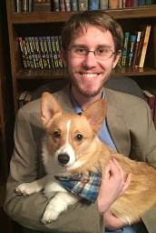

# The PythonSneks Teaching Field Guide

An introductory curriculum for learning Python, built following Instructional Design principles. The materials of the course are meant to be open-source and evaluated, in the hopes of establishing a baseline introductory level course. The target audience is explicitly undergraduate students in a university setting who are not computing majors, but are in STEM.

# Field Guide Outline

1. [Course Overview](guide_overview.md)
2. [Learner Analysis](learner_analysis.md)
3. [Course Topics](course_topics.md)
4. [Staff Roles](staff_roles.md)
5. [Tools](tools.md)
6. [Design Decisions](design_decisions.md)
7. [Setting up your Course](course_setup.md)
8. [Module Guide](module_guide.md)

*Appendices*

1. [Course Explanations](course_explanations.md)
2. [Alternative Courses](alternatives.md)

# Curriculum Materials

The following links allow you to browse the curriculum on GitHub:

- [Presentations](https://github.com/acbart/python-sneks/blob/master/presentations): Prerecorded and in-person presentation materials.
- [Lessons](https://github.com/acbart/python-sneks/blob/master/lessons): The transcripts of the prerecorded videos along with the organization of activities to complete in chunks.
- [Projects](https://github.com/acbart/python-sneks/blob/master/projects): The public version of the project writeups, without the starter code.
- [Quizzes](https://github.com/acbart/python-sneks/blob/master/quizzes): The public version of the quizzes (without the answers).
- [References](https://github.com/acbart/python-sneks/blob/master/references): Reference materials including API documentation for strings and the turtle module.
- [Reflections](https://github.com/acbart/python-sneks/blob/master/reflections): Writing assignment writeups that require students to reflect and respond.
- [Programming](https://github.com/acbart/python-sneks/blob/master/programming): Programming question writeups and starter code.
- [Evaluations](https://github.com/acbart/python-sneks/blob/master/evaluations): Analyses we conducted in evaluating our course.

# The Canvas Site

The materials here are destined for a Canvas site. Materials are synchronized using [Waltz](https://github.com/acbart/waltz) (well, they are in Version 2; in Version 1 we had a more ad-hoc script, but eventually pulled the "final" versions using Waltz).

You can visit the Canvas site here: [https://canvas.instructure.com/courses/1380806](https://canvas.instructure.com/courses/1380806)

# Credit

A number of people have been involved and should be recognized:

* Cory Bart is the project leader - he made a lot of stuff and is very tired.
* Larry Cox is the instructional designer and has been invaluable for both curriculum development, paper writing, and project planning.
* Allie Sarver was an undergraduate research assistant and did some awesome research on how we used peer learning in the course.
* Michael Friend was an undergraduate research assistant and did some awesome research on the effect of worked examples on student learning.
* Panagiotis Apostolellis taught with the curriculum in Spring 2018, giving both valuable feedback and BEAUTIFUL slides.
* Cal Ribbens spearheaded the funding for a grant from TLOS and was responsible for starting this effort.
* TLOS gave us lot's of money and guidance to rebuild the course.

